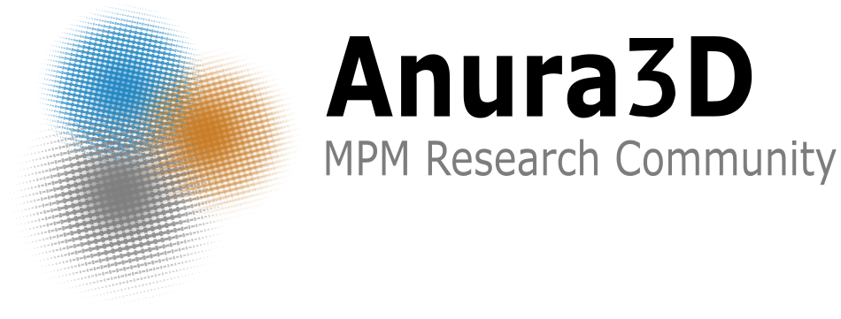

_Anura3D_ is a software for the numerical modelling and simulation of large deformations and
soil–water–structure interaction using the material point method (MPM). Copyright (C) 2020 Members of the Anura3D MPM Research Community.

**Anura3D** is **free** you can redistribute it and/or modify it under the terms of the GNU Lesser General Public License as published by the Free Software Foundation <https://www.gnu.org/licenses/>, either version 3 of the License, or (at your option) any later version

Anura3D is distributed in the hope that it will be useful, but WITHOUT ANY WARRANTY; without even the implied warranty of MERCHANTABILITY or FITNESS FOR A PARTICULAR PURPOSE. See the GNU Lesser General Public License for more details.

# Main Features

The features implemented in the open source are briefly summarized in the Table below. While some of them have been tested, others are still under development. The examples provided in the tutorial provide guidance to the user through the available tested features.

_State legend_:

✔️: Available and tested

🚧: Under development

|Feature| State|
|---|---|
|**Geometrical dimensions**| |
|2D-plane strain | ✔️|
|2D-axisymmetric | 🚧|
|3D-cartesian| ✔️|
|3D-cylindrical| ✔️|

Current state of *Anura3D* and limitations can be found in the [tutorial manual](https://github.com/Anura3D/Anura3D_OpenSource/blob/main/src/GiD_Problemtype/doc/TutorialManual_2021.pdf)

# Documentation
In this section you can find how to get started with _Anura3D_:
## Tutorial manual
The [tutorial manual](https://github.com/Anura3D/Anura3D_OpenSource/blob/main/src/GiD_Problemtype/doc/TutorialManual_2021.pdf) is a comprehensive guide that shows how to compile, preprocess, and postprocess problems with Anura3D, GID, and Paraview.

You can also watch our tutorials in our YouTube channel. A link to the different tutorial videos is below.

* [Introduction to Anura3D](https://www.youtube.com/watch?v=6Rx98oyO51A)
* [How to download and compile Anura3D](https://www.youtube.com/watch?v=1qlRcZvAZ_A)
* [Overview of the calculation process](https://www.youtube.com/watch?v=-kbWmlQrfao)
* [One-dimensional consolidation (oedometric compression test)](https://www.youtube.com/watch?v=nvOIf05ie4k)
* [Triaxial compression test](https://www.youtube.com/watch?v=a7qNT_Qo8Tg)
* [Sliding blocks] 🚧
* [Column collapse](https://www.youtube.com/watch?v=3dvcvYgI2cIs)
* [Shallow Foundation](https://www.youtube.com/watch?v=p4YjcpIk0uE)
* Impact problem [2D](https://www.youtube.com/watch?v=qiXNbpx0vZc) and [3D](https://www.youtube.com/watch?v=fNlEdc_nhgo)
* [Excavation](https://www.youtube.com/watch?v=TbTj6upumqs)
* [Submerged slope collapse](https://www.youtube.com/watch?v=kucDI3AKnRY)
* [Shallow foundation in 3D-cylindrical coordinates] 🚧

## Scientific manual

The [scientific manual](https://github.com/Anura3D/Anura3D_OpenSource/blob/main/src/GiD_Problemtype/doc/ScientificManual_2021.pdf) describes the numerical framework, theoretical models, and numerical techniques implemented in _Anura3D_.

<!-- ## Coding manual

We love people that modifies our code and develops useful and cool features. We provide the _coding manual_ to ensure uniformity of coding style, documentability, generality, and compatibility with existing features.

* link to the manual -->

# Examples of use
_Anura3D_ has been extensively used in various problems in geotechnical and coastal engineering. Below you can find videos of the usage of _Anura3D_ and links to presentations of members of the Anura3D Research Community.

* [Coseismic landslides and internal erosion](https://www.youtube.com/watch?v=Cd54tmVGG84)
* [An unsaturated formulation in MPM for dams and levees](https://www.youtube.com/watch?v=K0zl_Q3S6uM)
* [MPM simulation of penetration problems](https://www.youtube.com/watch?v=RHdNfkqyYqQ)

# News and events
Check for current news and past events organized by members of the Anura3D MPM Research Community [here](https://github.com/Anura3D/Anura3D_OpenSource/wiki/News-and-Events).

# Anura3D MPM Research Community
Find more about the Anura3D MPM Research Community and its members [here](https://github.com/Anura3D/Anura3D_OpenSource/wiki/Community-and-Members)

# Publications
Check for the publications related to the Anura3D MPM Research Community [here](https://github.com/Anura3D/Anura3D_OpenSource/wiki/Publications).

# Special Thanks
The support of CIMNE <https://www.cimne.com/> is greatly acknowledged.

<!-- # Users
Anura3D is used by: -->

# How to cite Anura3D
* Software:

Anura3D MPM Research Community (year) Anura3D version XXXX source code. <https://github.com/Anura3D/Anura3D_OpenSource>
* Manuals:

Anura3D MPM Research Community (year) Anura3D Tutorial Manual version XXXX

# Get in touch

If you have questions or comments use the discussion forum here. Otherwise, contact us at:

[info@anura3D.com](mailto:info@anura3d.com)
